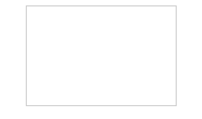
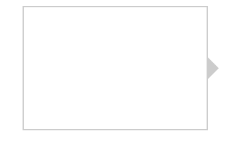
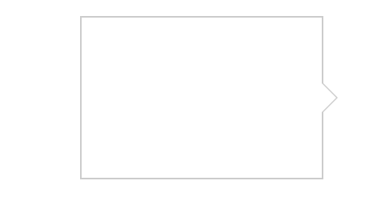

> 对于一个块级元素，但我们分别将元素的上下左右四个border设置成一个比较大的像素（如10px），样式设置成solid ,分别设置成不同的颜色的时候，同时将元素的width,height设置为0.这时我们将会看到四条边均呈现为三角形的形状。如图：


其css样式为：

```
        .element{
            width: 0px;
            height: 0px;
            border-top: 20px solid aqua;
            border-right: 20px solid #760000;
            border-bottom: 20px solid blue;
            border-left: 20px solid darkkhaki;
        }

```
一个普通的div。四个三角形分别是四条border四条border所呈现出来的，而我们最终的效果好像跟一个三角形的关系比较大些。如果得到一个三角形呢？其实这个很简单，我们只需要把其余三条border颜色属性设置为transparent（透明）的样式，另一个border的颜色属性保持不变。

看代码
>html部分
```
<div class="element">
 
</div>

```
>css部分
```CSS
.element{
    width: 0px;
    height: 0px;
    border-top: 20px solid transparent;
    border-right: 20px solid transparent;
    border-bottom: 20px solid transparent;
    border-left: 20px solid darkkhaki;
}

```
此时的效果：如下图


好了，三角形出来了。那我们也就实现了最为关键的的地方。我们在弄出来一个白色的三角形，然后将白色三角形覆盖到这个有色三角形之上，但是不能完全覆盖，让其露出一个尖角的效果来。这就是基本的原理。


#### 2.实现
首先需要一个div容器，设置border,width,height的属性，同时将设置其为相对定位。

上代码
>html部分
```
<div class="angle-wrapper">
    
</div>

```
>css部分
```CSS
.angle-wrapper {
    width: 300px;
    height: 200px;
    position: relative;
    margin: 20px auto;
    border: 2px solid #cccccc;
}

```
效果图如下：



然后需要为这个在这个div右边框上添加两个三角形，一个三角形颜色与边框颜色相同，另一个三角形颜为白色，用于覆盖第一个三角形颜色的一部分。

这里我们使用元素的伪选择器:before,:after来加入这两个三角形，before和after默认为行内元素，所以首先要将其设置为块级元素，绝对定位。

首先添加before伪选择器，用它来生成与border颜色的相同的第一个三角形，并将其定位到左边框上。

>上代码
```CSS
.angle-wrapper:before {
    content: '';
    width: 0;
    height: 0;
    border: 20px solid transparent;
    border-left-color: #cccccc;
    position: absolute;
    left: 100%;
    top: 50%;
    margin-top: -20px;
}

```
效果图如下：



然后添加after伪选择器，用它生成一个白色的三角形，并将其定位到左边框上。这里需要注意的是白色三角形的大小要比有色三角形要小一些，小多少要根据div边框的大小而定。我这里边框为2px,所以白色三角形就比灰色三角形就小两个px。这样可以避免白色三角形将灰色三角形全覆盖，然后可以产生尖角的效果来。（我这里说的大小就是设置三角形时的border的px值，如after这里是18px,before那里是20px）

>上代码：
```CSS
.angle-wrapper:after {
    content: "";
    width: 0;
    height: 0;
    border: 18px solid transparent;
    border-left-color: #FFFFFF;
    position: absolute;
    left: 100%;
    top: 50%;
    margin-top: -18px;
}

```
效果图如下：




完成。（这个对话框做的有点丑哈）
